# SENSOR KIT FOR ARDUINO
<table>
    <tr>
        <td>
            

            
(1) 7 color flash

            
            

        </td>
        <td>
            

            
(2) Ricevitore infrarossi

            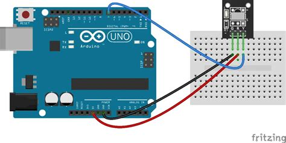
            

        </td>
        <td>
            

            
(3) Trasmettitore infrarossi

            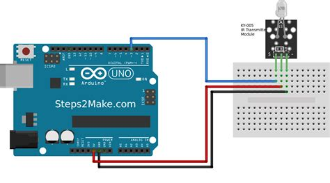
            

        </td>
        <td>
            

            
(4) Sensore di battito cardiaco

            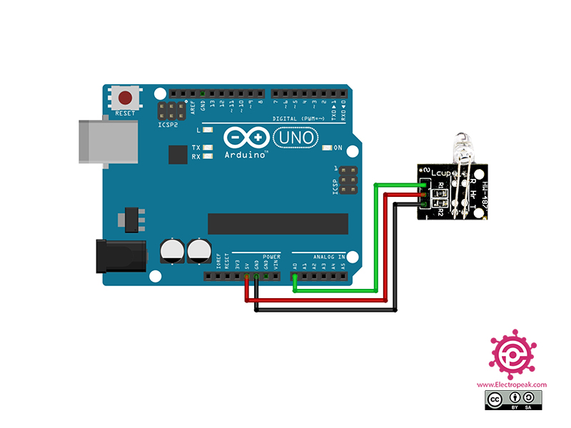
            

        </td>
    </tr>
    <tr>
        <td>
            

            
(5) hall magnatic

            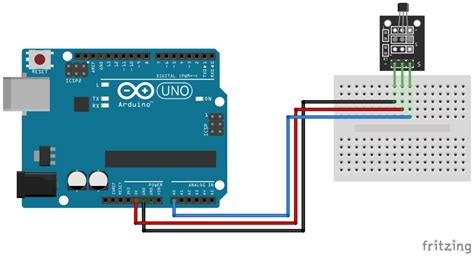
            

        </td>
        <td>
            

            
(6) flame

            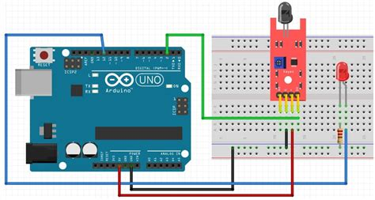
            

        </td>
        <td>        
            

            
(7) digital temp

            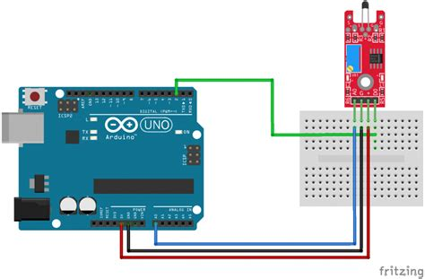
            

        </td>
        <td>
            

            
(8) buzzer

            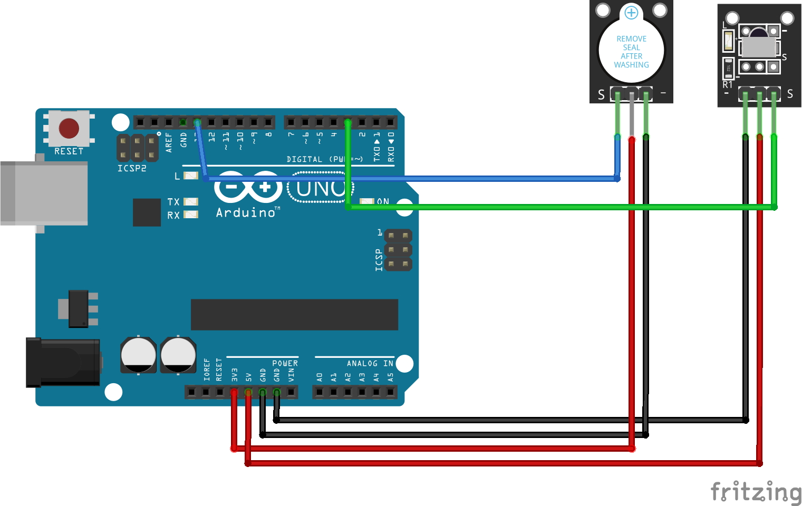
            

        </td>
    </tr>
    <tr>
        <td>
            

            
(9) button

            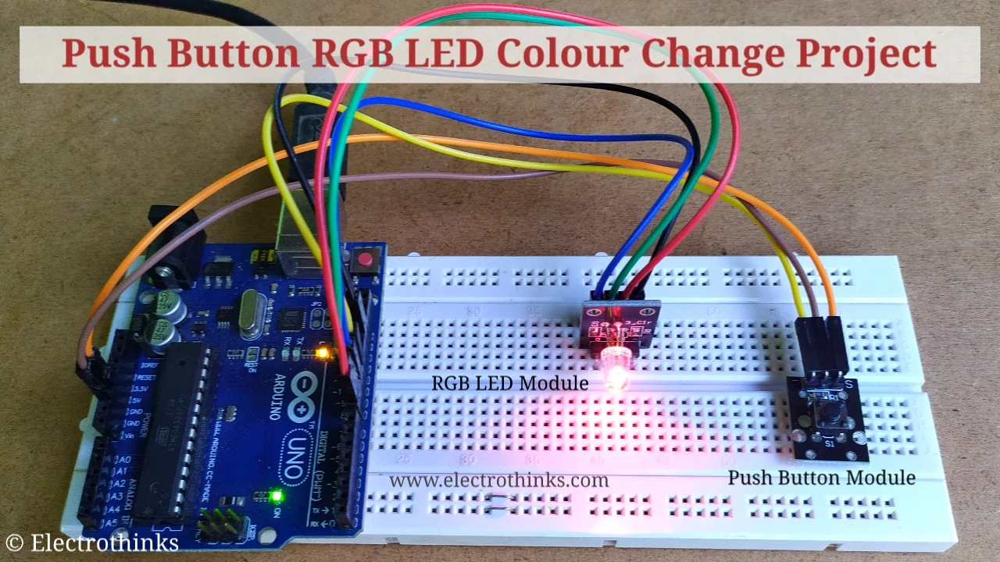
            

        </td>
        <td>
            

            
(10) big sound

            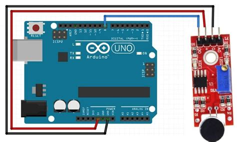
            

        </td>
        <td>
            

            
(11) ball switch

            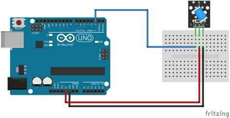
            

        </td>
        <td>
            

            
(12) avoid

            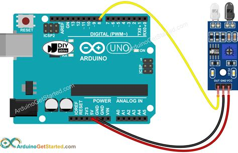
            

        </td>
    </tr>
    <tr>
        <td>
            

            
(13) analog temp

            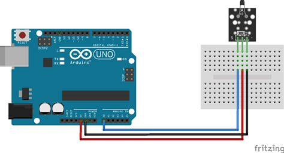
            

        </td>
        <td>
            

            
(14) joystick

            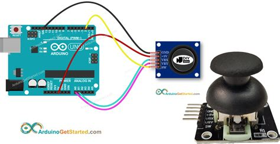
            

        </td>
        <td>
            

            
(15) laser emit

            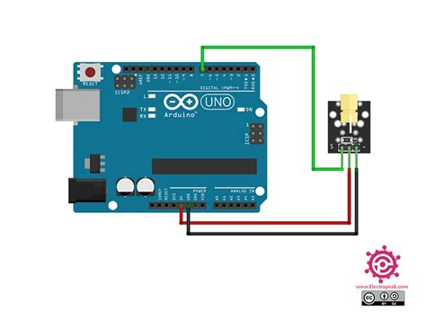
            

        </td>
        <td>
            

            
(16) light blocking

            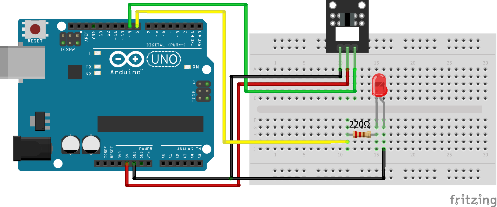
            

        </td>
    </tr>
    <tr>
        <td>
            

            
(17) light cup

            
            

        </td>
        <td>
            

            
(18) linear hall

            
            

        </td>
        <td>
            

            
(19) mini reed

            
            

        </td>
        <td>
            

            
(20) passive buzzer

            
            

        </td>
    <tr>
    </tr>
        <td>
            

            
(21) photoresistor

            
            

        </td>
        <td>
            

            
(22) reed switch

            
            

        </td>
        <td>
            

            
(23) relay

            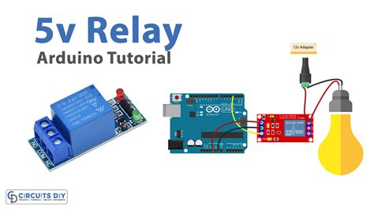
            

        </td>
        <td>
            

            
(24) rgb led

            
            

        </td>
    </tr>
    <tr>
            <td>
            

            
(25) rotary encoders

            
            

        </td>
        <td>
            

            
(26) shock

            
            

        </td>
        <td>
            

            
(27) small sound

            
            

        </td>
        <td>
            

            
(28) smd rgb

            
            

        </td>
    </tr>
    <tr>
        <td>
            

            
(29) tab module

            
            

        </td>
        <td>
            

            
(30) temp

            
            

        </td>
        <td>
            

            
(31) temp and humidity

            
            

        </td>
        <td>
            

            
(32) tilt switch

            
            

        </td>
    </tr>
    <tr>
        <td>
            

            
(33) touch

            
            

        </td>
        <td>
            

            
(34) tracking

            
            

        </td>
        <td>
            

            
(35) two color

            
            

        </td>
        <td>
            

            
(36) two color led

            
            

        </td>
    </tr>
    <tr>
        <td>
            

            
(36) analog hall

            
            

        </td>
    </tr>
</table>